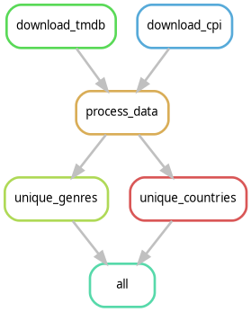

# Data Movies

ETL-пайплайн для сбора и подготовки данных к дашборду **DataLense**.

TODO: add screenshot

[Перейти к дашборду](https://datalens.yandex/0lqr1ktbcthyl)

## Источники данных

### TMDB Movie Dataset
Полный датасет фильмов с платформы Kaggle:  
[Ссылка на источник](https://www.kaggle.com/datasets/asaniczka/tmdb-movies-dataset-2023-930k-movies)  
Обновляется ежедневно.

### FRED (Federal Reserve Bank of St. Louis)
Источник данных по инфляции (индекс потребительских цен — CPI):  
[Ссылка на источник](https://fred.stlouisfed.org/series/CPIAUCNS)  
Обновление ежемесячно.

## Установка

1. Создайте файл `.env` на основе шаблона `.env.example`:
   - Укажите переменные `KAGGLE_USERNAME`, `KAGGLE_KEY`
   - Добавьте API-ключ `FRED_KEY`

2. Установите зависимости:
```bash
make install
```

## ETL



Запуск ETL:
```bash
make etl
```

| Скрипт | Назначение |
|------|-----------|
| `download_cpi.py` | Скачивает месячный индекс CPI из FRED по API-ключу `FRED_KEY` и сохраняет в `data/raw/cpi_data.csv`; нужен для инфляционной корректировки бюджетов и сборов. |
| `download_tmdb.py` | Через Kaggle API загружает полный датасет TMDB (930 k фильмов), распаковывает его и переименовывает итоговый CSV в `data/raw/tmdb_data.csv`. |
| `process_data.py` | Очищает данные TMDB, отбрасывает дубликаты и выбросы по выручке, соединяет с CPI, рассчитывает `current_budget` и `current_revenue`, сохраняет готовый датасет в `data/processed/processed_data.csv`. |
| `unique_countries.py` | Выделяет уникальные страны производства из `processed_data.csv`, сохраняет отсортированный список стран в `data/additional/unique_countries.csv`. Справочные данные |
| `unique_genres.py` | Выделяет уникальные жанры из `processed_data.csv`, сохраняет отсортированный список жанров в `data/additional/unique_genres.csv`. Справочные данные |

## Тестирование и проверка кода
```bash
make test    # запускает юнит-тесты (pytest)
make format  # автоформатирование black + isort
make lint    # проверка flake8, black, isort
```

## Лицензия
Проект распространяется под лицензией [MIT](LICENSE).

